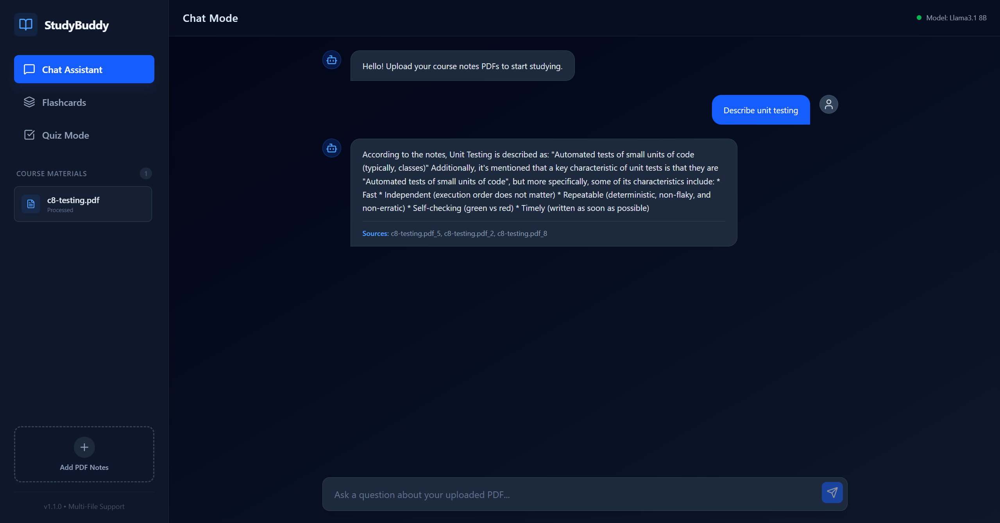

# 📚 Study Companion LLM App

Siddhant Das, 100830959

December 2nd, 2025

CSCI 4440 - Topics in CS: AI Dev

A RAG-based companion study app where you can upload course notes (PDFs). Then using RAG, you can have a chat assistant, a flashcard generator and a quiz generator, the ultimate study app.

**Video link:** https://www.youtube.com/watch?v=17KQ-34IvMk



## 🛠 Tech Stack
Frontend: React (Vite) + TypeScript + Tailwind CSS

Backend: Flask (Python) + ChromaDB (Vector Database) + Tools like Tesseract, Poppler

LLM: Ollama (Llama 3.1:8b)

## 🚀 How to run the app

### Docker Method
Install Docker desktop app and run it 
Then run this command in the route directory:
```
docker compose up --build
```

To shutdown the app run this command or press `CTRL+C`:
```
docker compose down
```

**Alternative manual method:**

Note: Need to have python3.10+, npm, ollama installed

1. Manually start the backend: 
```
cd backend
pip install -r requirements.txt
python app.py
```
2. Manually start the frontend:
```
cd frontend
npm install
npm run dev
```
3. Manually run Ollama:
```
ollama pull llama3.1
ollama serve
```
- Frontend is running on `http://localhost:8080/` (you need to open this one)
- Backend is running on `http://localhost:9000/`
- Ollama is running on `http://localhost:11434/`

> [WARNING]
> Running Docker with Ollama is very slow, either manually run everything or reconfigure to run Ollama without Docker

## 🔍 Tests

This app comes with offline unit testing and integration testing of LLM functions found in `llm.py` and safety tests based on `validate.py`. There is also an overall system test that combines this using `tests.json`

To run tests, make sure to install pytest via `pip install pytest` and then:
```
cd backend/tests
pytest test.py
```


## ✅ Project Requirements

### Core Features
There are user flows that call on llm via backend to chat with the model, make the model generate flashcards or quizzes and format it via backend and frontend

### Enhancements
This app uses Retrieval Augmented Generation and vector search via ChromaDB to retrieve context from pdfs

### Safety
There are safety validations on prompts to prevent jailbreaking such as "ignore previous instructions". Furthermore, the llms are provided with system prompts from the backend to assist with formatting such as proper json formats. Finally, the app have guardrails for length check; prompts can't exceed 5000 characters.

### Telemetry
Telemetry is logged for every endpoint in the backend and the logs can be found in `backend/telemetry_logs.jsonl`

### Testing/offline evaluation
There is offline testing that tests llm functions (`llm.py`) and safety (`validate.py`). 

### Reproducing results
To reproduce results as found in the video, please follow the steps in the "how to run" section.

### Nice to haves
There are many UX polishes including state management. Furthermore, this app uses session cookies to temporarily store chat history.

## 📜 Technical Archtecture Diagram & Project Directory

You can find the technical diagram here: [App Diagram](tech_doc_rag_app.pdf)

The project directory structure can be defined as:

```
... indicates irrelevant or dependency files


.
├── backend/ (contains the backend flask app)
│   ├── ...
│   ├── app.py (contains all the api endpoints for flask)
│   ├── DockerFile (docker file for backend, needed by docker compose)
│   ├── llm.py (commnuicates with ollama server)
│   ├── rag.py (used for RAG, pdf text extract and chromaDB vector search)
│   ├── requirements.txt (has all python packages for this app)
│   ├── telemetry_logs.jsonl (telemetry logs)
│   ├── telemetry.py (function for collecting telemetry on json endpoints)
│   ├── validate.py (safety sanitation on user input)
│   └── tests/
│       ├── ...
│       ├── test.py (pytest file for all tests)
│       └── tests.json (scenarios for overall system test)
├── frontend/ (contains the frontend react app)
│   ├── ...
│   ├── DockerFile (docker file for frontend)
│   └── src/
│       ├── ...
│       └── App.tsx (contains the react SPA as the UI for the app)
├── docker-compose.yaml (orchestrates the container for backend, frontend and ollama)
└── ...
```